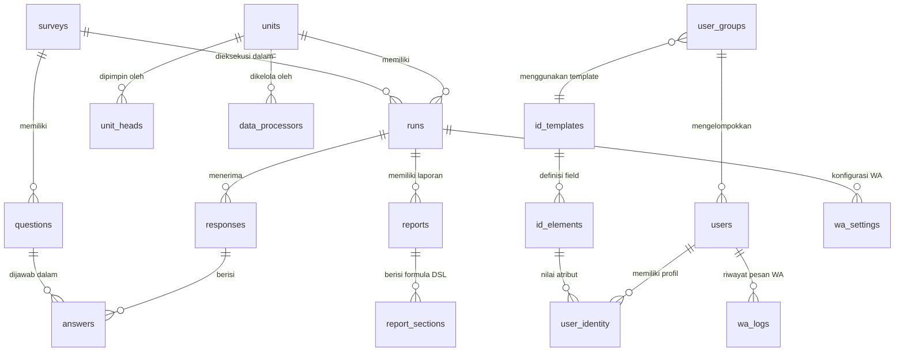
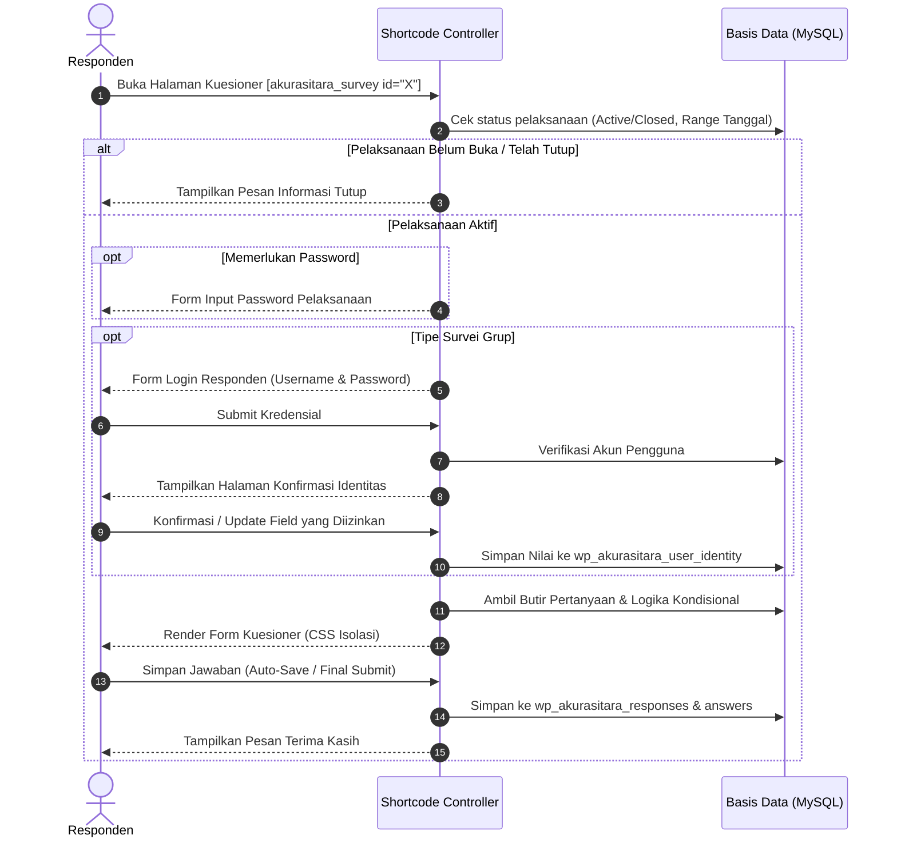
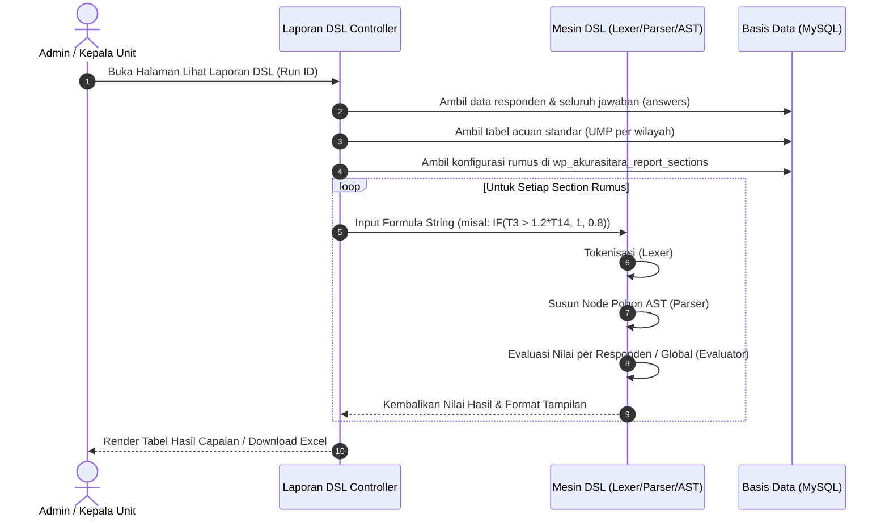

# Dokumentasi Arsitektur Sistem: AkurasiTara (Revisi)

Dokumen ini menjelaskan arsitektur teknis, struktur database, modul utama, alur kerja data, serta temuan audit sistem dari proyek **AkurasiTara (Revisi)**.

---

## 1. 📌 Ringkasan Sistem & Domain Bisnis

**AkurasiTara** adalah sistem manajemen kuesioner dan penilaian kinerja institusi berbasis **WordPress**, yang dikembangkan untuk menangani siklus survei terstruktur, terutama **Tracer Study Perguruan Tinggi** dan kalkulasi capaian **Indikator Kinerja Utama (IKU 1 Dikti / Kemendikbudristek)**.

Sistem ini mencakup seluruh rantai proses:
- Penyusunan kuesioner dan logika percabangan (*conditional branching* / *skip logic*).
- Pengelompokan responden dan manajemen identitas dinamis.
- Pelaksanaan survei berbasis token/password atau grup terotentikasi.
- Pengumpulan bukti berbasis link/URL (tanpa beban penyimpanan file di server lokal).
- Otomasi broadcast dan pengingat kuesioner via WhatsApp Gateway (Fonnte API).
- Mesin kalkulasi formula mandiri (**Universal Excel-like DSL Engine**) untuk menghitung skor IKU otomatis berdasarkan bobot pendapatan (relatif terhadap UMP), masa tunggu kerja, status studi, dan klasifikasi pekerjaan.

---

## 2. ⚙️ Spesifikasi Teknologi (Tech Stack)

| Lapisan | Komponen | Deskripsi |
| :--- | :--- | :--- |
| **Server Environment** | Laragon (Windows) | Apache / Nginx + MySQL + PHP 8.2 |
| **Platform Inti** | WordPress 7.1.x | Arsitektur plugin kustom |
| **Bahasa Pemrograman**| PHP 8.2.29 | Tipe data ketat (*strict typing*), OOP |
| **Basis Data** | MySQL / MariaDB | 18 tabel kustom berefiks `wp_akurasitara_` |
| **Frontend Form** | HTML5, Vanilla JS, CSS3 | Styling terisolasi (`akurasitara-form.css`) |
| **Visualisasi Data** | Chart.js & Flexbox Charts | Grafik batang, pie/donat hasil survei |
| **Mesin Formula** | Custom DSL Compiler | Lexer, AST Parser, dan Evaluator bawaan |
| **Gateway WhatsApp** | Fonnte REST API | Pengiriman notifikasi/blast dengan token dinamis |

---

## 3. 🗂️ Struktur Direktori Proyek

Aplikasi berpusat pada plugin kustom di dalam folder `wp-content/plugins/akurasitara/`:

```
c:/laragon/www/akusitararevisi/
├── wp-config.php                             # Konfigurasi database & environment WordPress
├── wp-content/
│   ├── plugins/
│   │   └── akurasitara/                      # Plugin Inti AkurasiTara
│   │       ├── akurasitara.php               # [6.674 baris] Controller utama, admin CRUD, shortcode form & hasil
│   │       ├── assets/
│   │       │   └── akurasitara-form.css      # Styling frontend formulir kuesioner
│   │       └── laporan/
│   │           ├── akurasitara-laporan-dsl.php           # Loader modul laporan & enqueue asset
│   │           ├── akurasitara-ext-reports-dsl-role.php  # [3.478 baris] Mesin DSL Excel, Tabel Acuan UMP, Role
│   │           ├── README-LAPORAN.txt                    # Catatan versi modul laporan
│   │           └── assets/
│   │               └── laporan-dsl.css                   # Styling UI formula builder & laporan
│   └── themes/                               # Tema WordPress bawaan
```

---

## 4. 🗄️ Skema Database & Relasi (18 Tabel Kustom)

Sistem menggunakan 18 tabel kustom untuk memisahkan data operasional survei dari data native WordPress:



### Rincian Fungsi Tabel:

1. **Struktur Master Survei & Organisasi**:
   - `wp_akurasitara_units`: Daftar unit kerja (fakultas/program studi/biro).
   - `wp_akurasitara_surveys`: Master judul kuesioner dan deskripsi survei.
   - `wp_akurasitara_questions`: Instrumen pertanyaan (`text`, `textarea`, `number`, `date`, `radio`, `select`, `checkbox`, `label`). Mendukung logika percabangan bersyarat (`cond_parent_id`, `cond_operator`, `cond_value`, `cond_action`).
   - `wp_akurasitara_runs`: Pelaksanaan survei per periode/tahun (`status`, `is_active`, `start_date`, `end_date`, `password`, `survey_type`: `general` vs `group`).

2. **Responden & Data Partisipasi**:
   - `wp_akurasitara_id_templates`: Master template identitas pengguna.
   - `wp_akurasitara_id_elements`: Elemen field identitas (tipe, pilihan dropdown, flags: `editable_by_user`, `show_in_results`).
   - `wp_akurasitara_user_groups`: Kelompok sasaran responden (misal: Alumni Angkatan 2024).
   - `wp_akurasitara_users`: Akun responden (`username`, `password_hash`, relasi ke grup dan unit).
   - `wp_akurasitara_user_identity`: Penyimpanan atribut dinamis pengguna (NIM, NIK, No WA, alamat) yang merujuk ke elemen identitas.
   - `wp_akurasitara_responses`: Header sesi pengisian (`fill_status`: `in_progress` vs `completed`, IP address, timestamp).
   - `wp_akurasitara_answers`: Jawaban mendalam per butir pertanyaan (`answer_text`, `file_url` untuk bukti tautan).

3. **Manajemen Hak Akses Berjenjang (RBAC)**:
   - `wp_akurasitara_unit_heads`: Pemetaan pengguna WordPress sebagai **Kepala Unit**.
   - `wp_akurasitara_data_processors`: Pemetaan pengguna WordPress sebagai **Pengolah Data Unit**.

4. **Kalkulasi & Pelaporan Lanjutan (DSL)**:
   - `wp_akurasitara_reports`: Konfigurasi laporan per pelaksanaan survei.
   - `wp_akurasitara_report_sections`: Baris indikator / section rumus yang dievaluasi oleh DSL Engine.
   - `wp_akurasitara_report_formulas`: Riwayat dan template rumus yang dapat digunakan kembali.

5. **Notifikasi WhatsApp**:
   - `wp_akurasitara_wa_settings`: Konfigurasi API Fonnte per pelaksanaan survei (token, template pesan, jeda delay, jadwal).
   - `wp_akurasitara_wa_logs`: Audit trail pengiriman WA (`sent`, `failed`, `invalid`, kode respon, response body).

---

## 5. 🧩 Komponen & Modul Utama

### A. Modul Kuesioner & Frontend Form (`[akurasitara_survey]`)
- Dirender melalui shortcode WordPress `[akurasitara_survey id="X"]`.
- Alur:
  1. Validasi jadwal dan status ketersediaan (*open/closed*).
  2. Proteksi password (jika diatur).
  3. Proteksi login grup (jika survei berbasis grup).
  4. Konfirmasi & verifikasi data identitas responden sebelum masuk form pertanyaan.
  5. Pengelompokan bagian survei secara dinamis menggunakan tipe elemen `label`.
  6. Evaluasi aturan kondisional (*conditional logic* / *skip logic*) secara real-time di sisi browser.
  7. Penyimpanan progres bertahap (*auto-save in-progress*) dan penyelesaian (*final submit*).

### B. Mesin Formula Universal DSL (`AkurasiTara_DSL_Engine`)
Merupakan komponen paling canggih di dalam sistem, bertindak sebagai *expression parser* mandiri:
- **Lexer (`AkurasiTara_DSL_Lexer`)**: Melakukan tokenisasi string formula menjadi token operator, bilangan, string literal, identifikasi variabel ($T_1, T_2, \dots$), dan pemanggilan fungsi.
- **Parser (`AkurasiTara_DSL_Parser`)**: Membangun pohon sintaks abstrak (*Abstract Syntax Tree* / AST) dengan menerapkan prioritas operator matematika standar (*operator precedence*).
- **Evaluator (`AkurasiTara_DSL_Evaluator`)**: Mengeksekusi node-node AST terhadap konteks data responden (*Context*), variabel nilai UMP acuan regional, dan agregasi data survei.
- **Fungsi yang Didukung**:
  - Logika: `IF(kondisi, jika_benar, jika_salah)`, `AND`, `OR`, `NOT`
  - Aritmatika: `+`, `-`, `*`, `/`, `%`, `^`
  - Perbandingan: `==`, `!=`, `<`, `<=`, `>`, `>=`
  - Agregasi: `COUNT()`, `SUM()`, `AVG()` / `AVERAGE()`, `MIN()`, `MAX()`
  - Matematika: `ROUND()`, `ABS()`, `SQRT()`, `FLOOR()`, `CEIL()` / `CEILING()`, `POW()` / `POWER()`
  - Notasi Sigma: Simbol `Σ`, `∑`, `SUM_I` untuk penjumlahan berbasis iterasi indeks.

### C. Modul Integrasi WhatsApp Gateway (Fonnte API)
- Mengirim pesan massal berjadwal langsung ke nomor telepon responden yang tercatat pada identitas.
- Normalisasi nomor otomatis ke format internasional (misal awalan `08` menjadi `628`).
- Penggantian variabel template secara dinamis:
  - `@nama` $\rightarrow$ Nama lengkap responden
  - `@username` $\rightarrow$ Username akun
  - `@password` $\rightarrow$ Password akun
  - `@link` $\rightarrow$ Tautan langsung ke halaman pengisian survei
- Monitoring pengiriman: Log audit lengkap dengan waktu pengiriman dan kode status HTTP response.

### D. Kontrol Akses Berbasis Peran (RBAC)
- **Administrator**: Memiliki hak penuh untuk konfigurasi master survei, pengaturan Fonnte, pembuatan unit kerja, penugasan role, dan ekspor laporan global.
- **Kepala Unit**: Memiliki akses terbatas untuk melihat hasil grafik, statistik responden, dan laporan performa khusus unit kerjanya.
- **Pengolah Data**: Memiliki hak mengelola data responden dan pelaksanaan survei di unit kerja terkait.
- **Responden**: Hanya dapat mengakses halaman pengisian dan verifikasi profil kuesioner miliknya.

---

## 6. 🔄 Alur Kerja Data (Data Flow Diagrams)

### Alur Responden Mengisi Kuesioner:


### Alur Evaluasi Laporan & Kalkulasi Formula DSL:


---

## 7. ⚠️ Temuan Audit Teknis & Area Perbaikan

### 1. Bug Kritis: HTML Entity Encoding pada Formula DSL (`&lt;` vs `<`)
- **Lokasi Kode**: [`akurasitara-ext-reports-dsl-role.php:2298`](file:///c:/laragon/www/akusitararevisi/wp-content/plugins/akurasitara/laporan/akurasitara-ext-reports-dsl-role.php#L2298)
- **Gejala**: Formula yang disimpan melalui form admin, seperti:
  ```excel
  IF(T3>1.2*T14, IF(T2<=0, 1, IF(T2<6, 1, 0.8)), 0.6)
  ```
  disanitasi menggunakan fungsi WordPress `sanitize_text_field()`. Fungsi tersebut mengonversi karakter `<` menjadi entitas HTML `&lt;`.
- **Dampak**: Database menyimpan `T2&lt;=0` dan `T2&lt;6`. Saat dibaca oleh `AkurasiTara_DSL_Lexer`, karakter `&` tidak dikenali sebagai operator relasional, menyebabkan parsing gagal dengan pesan:
  ```
  Fungsi 'IF()' kekurangan kurung tutup ')'
  ```
  sehingga perhitungan indikator menghasilkan nilai `0` atau `Error`.
- **Rekomendasi Penanganan**:
  1. Tambahkan pembersihan entitas pada konstruktor [`AkurasiTara_DSL_Lexer`](file:///c:/laragon/www/akusitararevisi/wp-content/plugins/akurasitara/laporan/akurasitara-ext-reports-dsl-role.php#L54):
     ```php
     $this->input = html_entity_decode((string)$input, ENT_QUOTES | ENT_HTML5, 'UTF-8');
     ```
  2. Gunakan sanitasi khusus ekspresi matematika saat menyimpan rumus, bukan `sanitize_text_field` bawaan.

### 2. File Monolitik Berukuran Sangat Besar
- [`akurasitara.php`](file:///c:/laragon/www/akusitararevisi/wp-content/plugins/akurasitara/akurasitara.php) memiliki ukuran **6.674 baris**, dan [`akurasitara-ext-reports-dsl-role.php`](file:///c:/laragon/www/akusitararevisi/wp-content/plugins/akurasitara/laporan/akurasitara-ext-reports-dsl-role.php) memiliki ukuran **3.478 baris**.
- Seluruh tanggung jawab (penanganan HTTP request, query database, HTML rendering, CSS/JS inline, logika bisnis formula) tergabung di file-file tersebut.
- **Rekomendasi**: Lakukan refaktorisasi modular secara bertahap memisahkan:
  - `src/Controllers/`
  - `src/Models/`
  - `src/Services/DSL/`
  - `src/Services/WhatsApp/`
  - `src/Views/`

### 3. Peringatan Notice PHP pada Mode CLI (`wp-config.php`)
- Pada [`wp-config.php:41-42`](file:///c:/laragon/www/akusitararevisi/wp-config.php#L41-L42):
  ```php
  if ( !defined('WP_CLI') ) {
      define( 'WP_SITEURL', $_SERVER['REQUEST_SCHEME'] . '://' . $_SERVER['HTTP_HOST'] );
      define( 'WP_HOME',    $_SERVER['REQUEST_SCHEME'] . '://' . $_SERVER['HTTP_HOST'] );
  }
  ```
  Saat skrip PHP dijalankan dari konsol terminal/CLI tanpa menyetel konstanta `WP_CLI`, variabel `$_SERVER['REQUEST_SCHEME']` dan `$_SERVER['HTTP_HOST']` bernilai `null` dan memicu *PHP Warning: Undefined array key*.
- **Rekomendasi**: Gunakan fallback default:
  ```php
  $scheme = $_SERVER['REQUEST_SCHEME'] ?? 'http';
  $host   = $_SERVER['HTTP_HOST'] ?? 'localhost';
  define( 'WP_SITEURL', $scheme . '://' . $host );
  define( 'WP_HOME',    $scheme . '://' . $host );
  ```

---

## 8. 🗺️ Roadmap Rekomendasi Peningkatan

1. **Prioritas 1 (Stabilitas Kalkulasi)**: Terapkan penanganan `html_entity_decode` pada `AkurasiTara_DSL_Lexer` dan perbaiki seluruh formula IKU-1 yang saat ini tersimpan dalam bentuk entitas HTML di tabel `wp_akurasitara_report_sections`.
2. **Prioritas 2 (Validasi Real-time)**: Tambahkan pengecekan sintaks formula AJAX pada antarmuka admin agar pembuat laporan segera mengetahui jika ada kurung atau operator yang salah sebelum disimpan.
3. **Prioritas 3 (Optimasi Query Evaluasi)**: Implementasikan pemuatan jawaban responden secara *eager-loading* (memori *in-memory cache*) saat mengevaluasi laporan yang melibatkan ratusan hingga ribuan responden guna mencegah degradasi performa (*N+1 query problem*).
